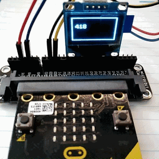

# I2C OLED 128x64 Display drive

I2C OLED 128x64 with 5x5 font module drive.  

Part of the drive base on fizban99's microbit OLED driver:  
https://github.com/fizban99/microbit_ssd1306  

  

## I2C Addr

Address is 0x3C / 0x3D, default is 0x3C.

## API

* **pixel(x, y, color=1)**  
set pixel in (x, y) using color.  
  **x** range:  
  * 0 - 127,  normal mode
  * 0 - 63,   zoom mode  

  **y** range:  
  * 0 - 63,  normal mode
  * 0 - 31,   zoom mode  

* **on()**  
turn on display  

* **off()**  
turn off display  

* **clear（）**  
clear content of the display  

* **zoom(d=1)**  
zoom mode on/off. in normal mode, pixel size is 1x1, in zoom mode, pixel size is 2x2.

* **invert(v=1)**  
invert display.  

* **draw()**  
redraw screen.  

* **text(x, y, s)**  
show a text string in screen.  
Character size is:  
  * 5 x 8, normal mode  
  * 10 x 16, zoom mode

  **x** range:  
  * 0 - 23,  normal mode
  * 0 - 11,  zoom mode  

  **y** range:  
  * 0 - 7,  normal mode
  * 0 - 3,  zoom mode  

* **hline(x, y, l, c=1)**  
draw a horizontal line. start point is (x, y), length is **l**.  

* **vline(x, y, l, c=1)**  
draw a vertical line. start point is (x, y), length is **l**.  

* **rect(x1, y1, x2, y2, c=1)**  
draw a rectangle.

## example

```
from microbit import *
import oled12864_i2c

oled = oled12864_i2c.OLED12864_I2C()
oled.clear()
oled.rect(0,0,60,30)

n = 0
while 1:
    oled.text(1,1, str(n))
    n += 1
    sleep(200)
```



From microbit/micropython Chinese community.  
www.micropython.org.cn
