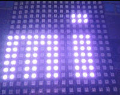

# micro:bit neopixel 16x16 display drive

Please use [microbit ToolBox](../../utils/microbit_toolbox) to generation code and data.

## API

* **set(n, color='')**  
set LED[n] to color  
n: 0-255  
color: LED color. if color is not given, it will using default color  

* **clear()**  
clear all LED  

* **setcolor(color)**  
set display color  

* **show(self, dat, offset=0, clear = True, color='')**  
show text or emijo.  
dat:    text or emijo data  
offset: display offset  
clear:  clear the display before show  
color:  new color  

  

From microbit/micropython Chinese community  
www.micropython.org.cn