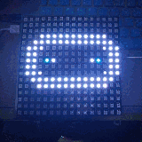
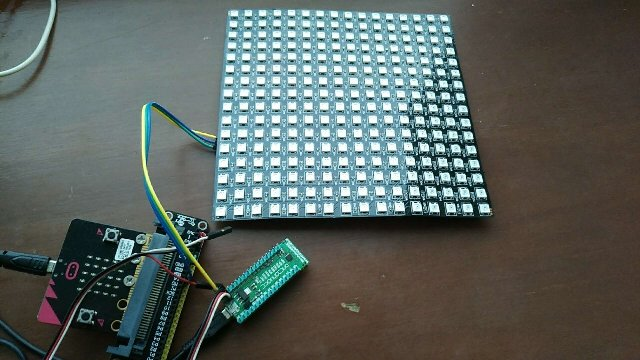

# micro:bit neopixel 16x16 color image display drive

Please use [microbit ToolBox](../../utils/microbit_toolbox) to generation code and data.

## API

* **clear()**  
clear all LED  

* **show(self, dat, offset=0)**  
show color emijo.  
dat:    color emijo data  
offset: display offset  

  

**Please note neopixel display must using external power.**  

From microbit/micropython Chinese community  
www.micropython.org.cn
