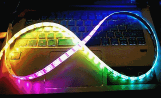

# micro:bit neopixel strip drive

  

## np_rainbow(np, count, bright=32, offset)
Show rainbow color in LEDs.

* **np**  
neopixel object  

* **count**  
neopixel LED count  

* **bright**  
maximum brightness of the LED. Bright between 0-255, default is 32.

* **offset**  
color offset, change offset will make the rainbow ratation. offset maybe positive or negative integer.

From microbit/micropython Chinese community  
www.micropython.org.cn