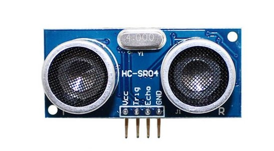

# HCSR04 ultrasonic Sensor drive for microbit



Using machine.time_pulse_us() function to get higher accuracy, high efficiency and less code for HCSR04 ultrasonic Sensor. 

The unit of return value is millimeter.


## example

```
from microbit import *
from time import sleep_us
from machine import time_pulse_us

def distance(tp, ep):
    ep.read_digital()
    tp.write_digital(1)
    sleep_us(10)
    tp.write_digital(0)
    ts = time_pulse_us(ep, 1, 5000)
    if ts > 0: return ts * 17 // 100
    return ts

while True:
    dist = distance(pin1, pin2)
    print(dist)
    sleep(500)

```

From microbit/micropython Chinese community.  
www.micropython.org.cn
