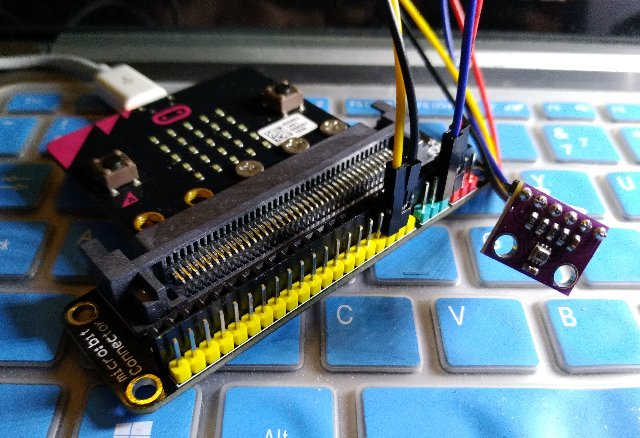

# BMP280 Digital pressure sensor mpy drive for microbit


## I2C Address

I2C Address depend SDO, defult address is:

**0x76**

When SDO is high address is:

**0x77**

## API

* **Temperature()**  
get envirment temperature 

* **Pressure()**  
get Pressure

* **Altitude()**  
Calculating absolute altitude

* **poweron()**  
goto normal mode

* **poweroff()**  
goto sleep mode

## example


```
from microbit import *
import bmp280

b = bmp280.BMP280()

while True:
    sleep(500)
    b.get()

```



From microbit/micropython Chinese community.  
www.micropython.org.cn
